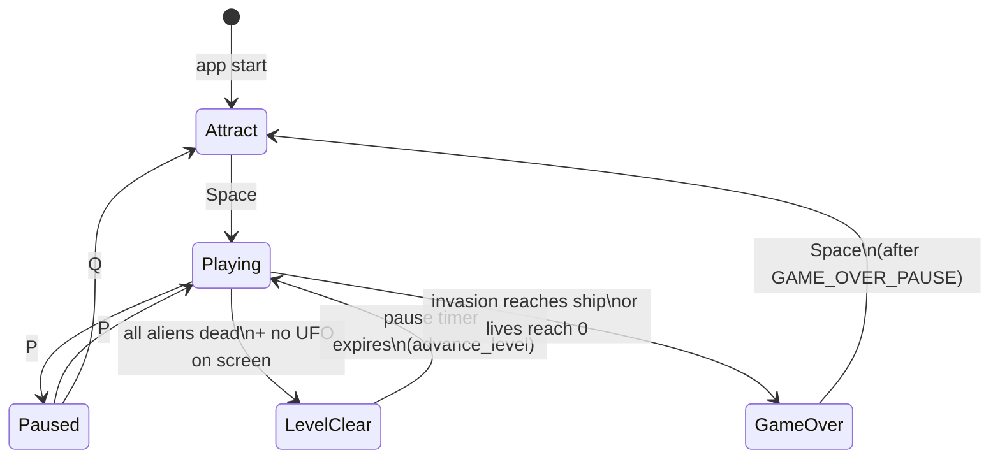
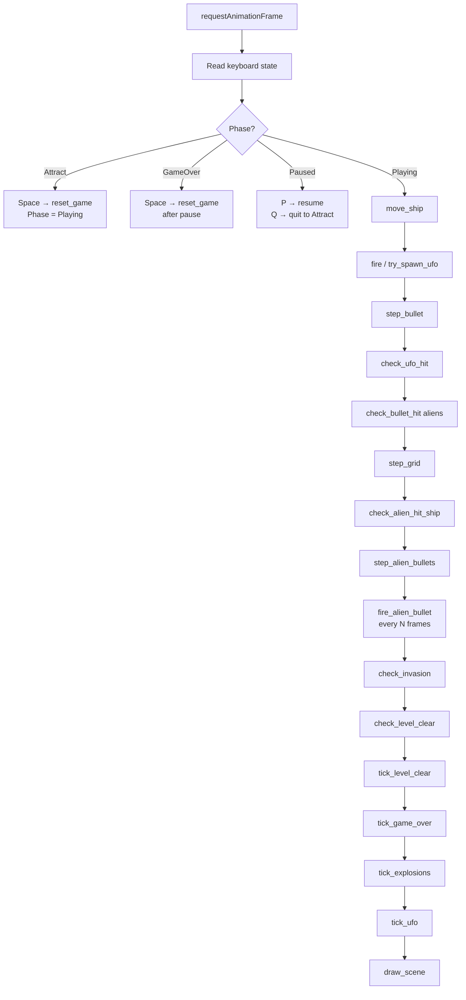
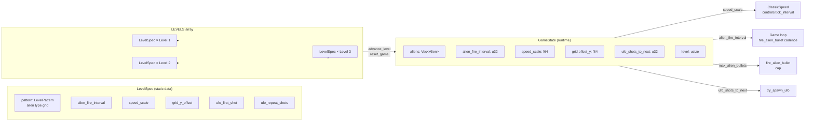
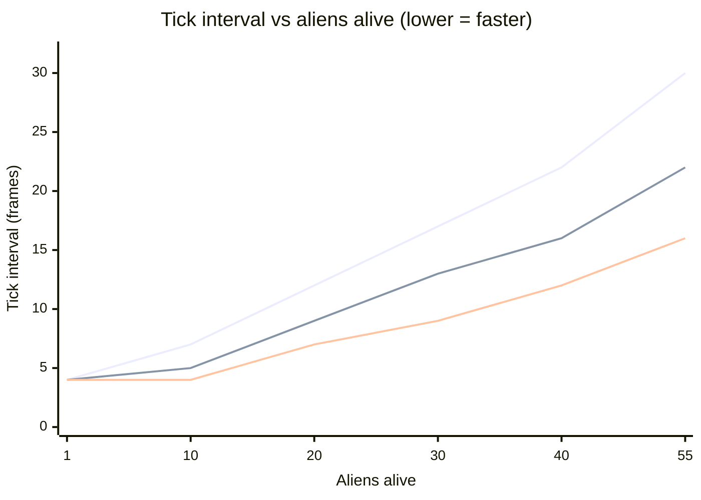

# Space Invaders — Architecture Diagrams

## 1. Game Phase State Machine



---

## 2. Per-Frame Update Pipeline



---

## 3. Level Specification Architecture



---

## 4. Classic Speed Curve

`ClassicSpeed` maps alive alien count → tick interval (frames between grid moves).
`speed_scale < 1.0` compresses the curve downward — the grid is faster throughout.



---

## 5. Level Grid Patterns & Difficulty Table

Each cell is one alien. Row 0 is the top of the formation.

```
Level 1         Level 2         Level 3         Level 4
S S S S S S S   S S S S S S S   S S S S S S S   S S S S S S S
C C C C C C C   S S S S S S S   S S S S S S S   S S S S S S S
C C C C C C C   C C C C C C C   S S S S S S S   S S S S S S S
O O O O O O O   O O O O O O O   C C C C C C C   C C C C C C C
O O O O O O O   O O O O O O O   O O O O O O O   C C C C C C C

Level 5         Level 6         Level 7
S S S S S S S   S S S S S S S   S S S S S S S
C S C S C S C   S S S S S S S   S S S S S S S
S S S S S S S   S C S C S C S   S S S S S S S
C S C S C S C   S S S S S S S   S S S S S S S
S S S S S S S   S S S S S S S   C C C C C C C

Levels 8-10 recycle patterns 6/7/6 at maximum difficulty settings.
S=Squid (30pts)  C=Crab (20pts)  O=Octopus (10pts)
```

| Level | fire_interval | speed_scale | grid_y_offset | max_bullets | ufo_first |
|-------|--------------|-------------|---------------|-------------|-----------|
| 1     | 90           | 1.00        | 0             | 3           | 23        |
| 2     | 65           | 0.75        | 1×CELL_H      | 3           | 20        |
| 3     | 45           | 0.55        | 2×CELL_H      | 3           | 15        |
| 4     | 38           | 0.50        | 2×CELL_H      | **4**       | 12        |
| 5     | 32           | 0.45        | 3×CELL_H      | 4           | 10        |
| 6     | 27           | 0.40        | 3×CELL_H      | **5**       | 8         |
| 7     | 23           | 0.36        | 4×CELL_H      | 5           | 7         |
| 8     | 20           | 0.32        | 4×CELL_H      | **6**       | 6         |
| 9     | 17           | 0.29        | 4×CELL_H      | 6           | 5         |
| 10    | 15           | 0.25        | 4×CELL_H      | **7**       | 4         |
